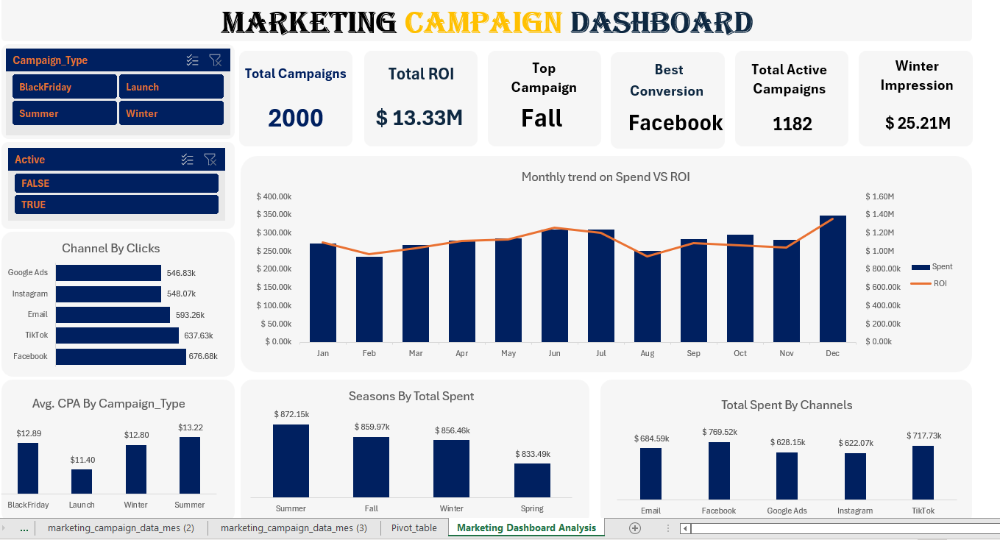

# Marketing Campaign Analysis Dashboard

## Project Overview

This project analyzes marketing campaign data to identify performance trends, evaluate key marketing metrics, and generate actionable business insights.

The analysis was carried out using Microsoft Excel, including data cleaning, calculated metrics, Pivot Tables, interactive filters, and dashboard visualizations.

## Objective

The objective of this project is to evaluate marketing campaign performance across different channels, campaign types, seasons, and time periods.

The analysis focuses on understanding campaign engagement, marketing spend, conversions, ROI, and cost efficiency.

## Tools Used

- Microsoft Excel
- Pivot Tables
- Excel Charts
- Data Cleaning
- Data Analysis
- Data Visualization

## Key Metrics

The dashboard analyzes metrics including:

- Total Campaigns
- Total ROI
- Marketing Spend
- Clicks
- Impressions
- Conversions
- Conversion Rate
- Cost per Acquisition (CPA)
- Active Campaigns

## Analysis

The project includes analysis of:

- Monthly marketing spend and ROI
- Clicks by marketing channel
- Marketing spend by channel
- Average CPA by campaign type
- Marketing spend by season
- Campaign performance across different categories
- Active versus inactive campaigns

## Dashboard

The interactive Excel dashboard provides a visual summary of marketing campaign performance using KPI cards, charts, and filters.

## Data Preparation

The dataset was reviewed and prepared before analysis. Data preparation included checking the dataset structure, handling data-quality issues, creating calculated metrics, and preparing the data for Pivot Table analysis.

## Key Skills Demonstrated

- Data Cleaning
- Exploratory Data Analysis
- KPI Analysis
- Pivot Table Analysis
- Data Visualization
- Business Analytics
- Excel Dashboard Development
- Data Interpretation

## Project File

**Marketing Dashboard (1).xlsx** — Contains the dataset, data preparation, calculated metrics, Pivot Tables, and interactive dashboard.
